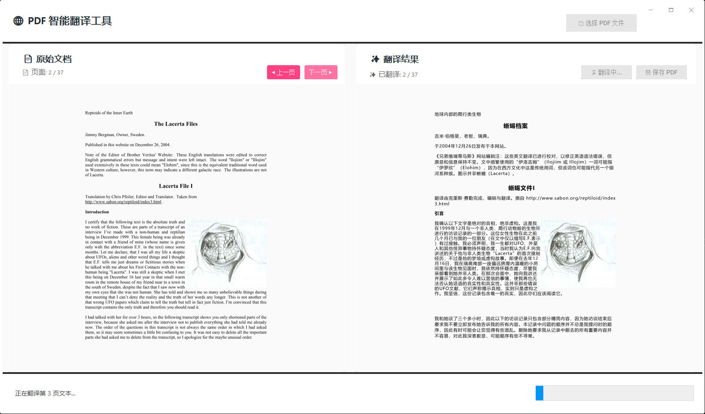

# PDF Translation Tool - Qwen3-VL-8B

[English (Default)](./README.md) | [中文](./README.zh-CN.md)

This is a Windows Forms-based PDF translation tool powered by `llama.cpp + Qwen3-VL-8B`, running the model locally for visual understanding and translation, with **no paid cloud endpoint and no paid API required**.

## Features

- ✅ **High-Definition Preview**: 2000px high-resolution rendering with crystal-clear text and images ⭐ NEW
- ✅ **Local Free Inference**: Run via llama.cpp locally, no paid endpoint required ⭐ NEW
- ✅ **Modern UI**: ReaLTaiizor Metro theme, professional and elegant
- ✅ **PDF Preview**: Load and browse every page of PDF files
- ✅ **Intelligent Translation**: Recognize and translate PDF content using Qwen3-VL-8B model
- ✅ **Real-time Preview**: View translation results in real-time during translation
- ✅ **Dual-Panel Comparison**: Side-by-side comparison of original and translated text
- ✅ **Format Preservation**: Maintain original document layout and formatting as much as possible
- ✅ **Batch Processing**: Automatically translate all pages of entire PDF documents
- ✅ **High Performance**: Based on Google PDFium, fast and stable
- ✅ **Export Function**: Save translated content as new PDF files
- ✅ **Vision Bounding-Box Rendering**: Structured `bounding_box` parsing, single-line centered fit, and adaptive background cleanup ⭐ NEW

## System Requirements

- Windows 10/11
- .NET 8.0 or higher
- llama.cpp server running (port 8033)
- Qwen3-VL-8B model

## Prerequisites

### 1. Start llama.cpp server

Before using this tool, make sure the llama.cpp server is running. Use the following command to start the server:

```bash
llama-server --jinja -c 32768 -ngl 50 -b 4096 -ub 2048 -fa on -t 16 -tb 16 --mlock --port 8033 -m D:\work\API\SF.Laundry.Solution\LLamaSharp\LLama.Examples\Assets\Qwen3-VL-8B\Qwen3VL-8B-Instruct-Q4_K_M.gguf --alias "Qwen3 VL 8B" --mmproj D:\work\API\SF.Laundry.Solution\LLamaSharp\LLama.Examples\Assets\Qwen3-VL-8B\mmproj-Qwen3VL-8B-Instruct-F16.gguf --mmproj-offload --host 127.0.0.1 --image-max-tokens 1024 --image-min-tokens 512

llama-server --jinja -ngl 40 -b 4096 -ub 2048 -fa on -t 20 -tb 16 --mlock --port 8033 -m D:\work\API\SF.Laundry.Solution\LLamaSharp\LLama.Examples\Assets\Qwen3-VL-8B\Qwen3VL-8B-Instruct-Q4_K_M.gguf --alias "Qwen3 VL 8B" --mmproj D:\work\API\SF.Laundry.Solution\LLamaSharp\LLama.Examples\Assets\Qwen3-VL-8B\mmproj-Qwen3VL-8B-Instruct-F16.gguf --mmproj-offload --host 127.0.0.1 --image-max-tokens 1024 --image-min-tokens 512

```

Make sure the server is running at `http://127.0.0.1:8033`.

### 2. Install Dependencies

The project uses the following NuGet packages (**all free and commercially usable**):

- `Docnet.Core` (MIT) - PDF rendering engine (based on Google PDFium) ⭐ NEW
- `PdfSharpCore` (MIT) - PDF creation and processing
- `Newtonsoft.Json` (MIT) - JSON serialization
- `ReaLTaiizor` (MIT) - Modern UI control library

These packages will be automatically installed during build. All dependency libraries use permissive open-source licenses, **fully support .NET 8**, and can be **freely used in commercial projects**.

## Usage

1. **Start the Application**
   - Run `PdfTranslate.exe`

2. **Load PDF File**
   - Click the "Select PDF File" button
   - Choose the PDF file to translate
   - After loading, the first page preview will be displayed

3. **Browse PDF Pages**
   - Use "Previous" and "Next" buttons to browse the document
   - The left side displays the original PDF pages

4. **Start Translation**
   - Click the "Start Translation" button
   - The tool will translate the PDF content page by page
   - The right side displays the translated pages in real-time
   - Progress bar shows translation progress

5. **Save Translation Results**
   - After translation is complete, click the "Save Translated PDF" button
   - Choose the save location and filename
   - The translated PDF will be saved

## Runtime Result

Current runtime UI and real-time translation result (original on the left, translated on the right):



## Interface Description

### Professional ReaLTaiizor UI ⭐ NEW
This tool uses the **ReaLTaiizor** professional UI library with Metro theme design:
- 🎨 **MetroButton** - Modern flat buttons
- ✨ **MetroLabel** - Clean text labels
- 🎯 **MetroProgressBar** - Smooth progress bars
- 💡 **HeaderLabel** - Eye-catching titles
- 🖱️ **Smooth Animations** - Built-in transition effects
- 🎭 **Multi-theme Support** - Light/Dark/Custom

### Custom Title Bar ⭐ NEW
- **Dark Title Bar**: Professional dark gray-black background (#1E1E1E)
- **Window Controls**: Minimize (─) | Maximize (□) | Close (✕)
- **Draggable**: Click anywhere on the title bar to drag the window
- **Title**: 🌐 PDF Intelligent Translation Tool - Qwen3-VL-8B

### Operation Area
- **📁 Select PDF File**: Load the PDF to translate (blue button)

### Left Panel - 📄 Original Document
- **◀ Previous**: View previous page (blue button)
- **Next ▶**: View next page (blue button)
- **Page Information**: Display current page / total pages
- **Preview Area**: High-quality display of original PDF pages

### Right Panel - ✨ Translation Results
- **🚀 Start Translation**: Start translating the entire PDF document (orange button)
- **💾 Save PDF**: Save translation results as a new file (green button)
- **Translated Pages**: Display translation progress
- **Preview Area**: Real-time display of translated page content

### Bottom Status Bar
- **✓ Status Information**: Display current operation status (with emoji hints)
- **Progress Bar**: Visual display of translation progress

For detailed technical documentation, please refer to:
- **[Docnet.Core使用说明.md](Docnet.Core使用说明.md)** - PDF rendering library usage guide ⭐ NEW
- **[ReaLTaiizor使用说明.md](ReaLTaiizor使用说明.md)** - UI library usage guide
- [现代化UI设计v2.md](现代化UI设计v2.md) - v2.0 design documentation
- [UI设计说明.md](UI设计说明.md) - v1.2 design documentation
- [UI更新日志.md](UI更新日志.md) - Update history

## Technical Architecture

### Core Technologies
- **Windows Forms**: UI framework
- **ReaLTaiizor** (MIT): Modern UI control library
- **Docnet.Core** (MIT): PDF rendering engine (based on Google PDFium) ⭐ NEW
- **PdfSharpCore** (MIT): PDF creation and processing
- **HttpClient**: Communication with llama.cpp API

### Translation Workflow
1. Render PDF pages as high-resolution images (300 DPI)
2. Convert images to Base64 encoding
3. Send to Qwen3-VL-8B model for visual recognition and translation (returns `original / translated / bounding_box`)
4. Parse structured bounding boxes and map them to page coordinates
5. Erase original text and render translation with adaptive background cleanup, auto text color, and centered single-line scaling
6. Combine all translated pages into a new PDF file

## API Configuration

Default API endpoint: `http://127.0.0.1:8033/v1/chat/completions`

To modify the API endpoint or other configurations, please modify the following constant in `Form1.cs`:

```csharp
private const string LLAMA_API_URL = "http://127.0.0.1:8033/v1/chat/completions";
```

## Important Notes

1. **Model Loading**: Ensure the Qwen3-VL-8B model is correctly loaded into the llama.cpp server
2. **Memory Usage**: Translating large PDF files will consume significant memory
3. **Translation Time**: Translation time per page depends on page complexity and model performance
4. **Format Preservation**: The current version converts content to text format; complex layouts may require manual adjustment
5. **Network Connection**: Ensure the local llama.cpp server is accessible

## Future Improvements

- [ ] Support for preserving more complex PDF formats (tables, multi-column layouts, etc.)
- [ ] Support OCR recognition for scanned PDFs
- [ ] Support batch translation of multiple PDF files
- [ ] Add translation quality assessment
- [ ] Support multiple translation language selection
- [ ] Optimize memory usage and performance

## Troubleshooting

### Issue: Cannot connect to llama.cpp server
**Solution**: 
- Check if the llama.cpp server is running
- Verify port 8033 is correct
- Check firewall settings

### Issue: Translation is very slow
**Solution**:
- Ensure GPU acceleration is enabled (-ngl parameter)
- Reduce PDF rendering resolution
- Check system resource usage

### Issue: Poor translation quality
**Solution**:
- Adjust prompt wording
- Increase max_tokens parameter
- Use a higher quality model

## License

This project is licensed under the MIT License, **completely free and usable for commercial projects**.

### Dependency Library Licenses
- **Docnet.Core**: MIT License ✅ Commercially usable ✅ Supports .NET 8 ⭐ NEW
- **ReaLTaiizor**: MIT License ✅ Commercially usable ✅ Supports .NET 8
- **PdfSharpCore**: MIT License ✅ Commercially usable
- **Newtonsoft.Json**: MIT License ✅ Commercially usable

All dependency libraries use permissive open-source licenses, **fully support .NET 8 and above**, and you can confidently use this tool for commercial projects without paying any licensing fees.

## Contact

For questions or suggestions, please submit an Issue.


